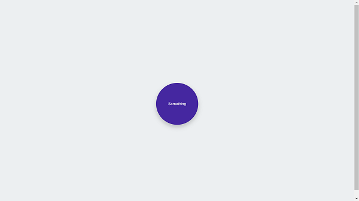

# ONEDEV

Olá Seja Bem-Vindo :)!

ButtonMaterial foi o primeiro desafio do dia 21/10/2020, nele desenvolvemos ao vivo o botão com efeito de propagação de onda do Material Designer(Style Guide) da Google usado no Android.

# Fonte(s):
1. CSS Tricks (Codigo base): https://css-tricks.com/snippets/css/css-text-shadow/
2. Documentação do Material Designer:
a. https://material.io/components/buttons-floating-action-button

b. https://material.io/develop/web/components/buttons/floating-action-buttons

c. https://material.io/resources/color/#!/?view.left=1&view.right=0&secondary.color=212121&primary.color=4527A0

# Conceitos Matematicos:
1. https://pt.wikipedia.org/wiki/Di%C3%A2metro
2. https://pt.wikipedia.org/wiki/Raio_(geometria)

# Debug

1. Como funciona a função Scale: https://developer.mozilla.org/pt-BR/docs/Web/CSS/transform-function/scale

2. O que é a proprieadade ClientX: https://developer.mozilla.org/pt-BR/docs/Web/API/MouseEvent/clientX

3. https://developer.mozilla.org/pt-BR/docs/Web/API/HTMLElement/offsetLeft

4. O que é a propriedade ClientWidth: https://developer.mozilla.org/pt-BR/docs/Web/API/Element/clientWidth

5. O que é a função matematica Max: https://developer.mozilla.org/pt-BR/docs/Web/JavaScript/Reference/Global_Objects/Math/max
